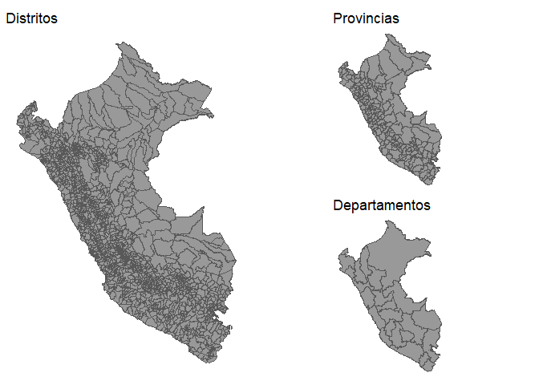

PeruData
================

Datos de diferentes fuentes dentro del Perú

# Datos espaciales (`map_peru_*`)

``` r
library(sf)
```

    ## Linking to GEOS 3.9.1, GDAL 3.2.1, PROJ 7.2.1; sf_use_s2() is TRUE

## Departamentos

``` r
head(PeruData::map_peru_depa)
```

    ## Simple feature collection with 6 features and 3 fields
    ## Geometry type: MULTIPOLYGON
    ## Dimension:     XY
    ## Bounding box:  xmin: -79.45384 ymin: -17.28501 xmax: -70.80665 ymax: -2.986125
    ## Geodetic CRS:  WGS 84
    ## # A tibble: 6 x 4
    ##   iddpto departamen capital                                             geometry
    ##   <chr>  <chr>      <chr>                                     <MULTIPOLYGON [°]>
    ## 1 01     Amazonas   Chachapoyas (((-77.69596 -5.411053, -77.7127 -5.416411, -77~
    ## 2 02     Ancash     Huaraz      (((-77.31749 -8.530152, -77.31503 -8.543121, -7~
    ## 3 03     Apurimac   Abancay     (((-73.51512 -13.38494, -73.5148 -13.3848, -73.~
    ## 4 04     Arequipa   Arequipa    (((-71.03897 -15.40517, -71.02712 -15.43204, -7~
    ## 5 05     Ayacucho   Ayacucho    (((-73.98045 -12.24259, -73.9811 -12.24991, -73~
    ## 6 06     Cajamarca  Cajamarca   (((-77.99951 -6.970532, -77.99362 -6.977896, -7~

## Provincias

``` r
head(PeruData::map_peru_prov)
```

    ## Simple feature collection with 6 features and 5 fields
    ## Geometry type: MULTIPOLYGON
    ## Dimension:     XY
    ## Bounding box:  xmin: -78.71089 ymin: -6.986709 xmax: -77.1323 ymax: -2.986125
    ## Geodetic CRS:  WGS 84
    ## # A tibble: 6 x 6
    ##   iddpto departamen idprov provincia   capital                          geometry
    ##   <chr>  <chr>      <chr>  <chr>       <chr>                  <MULTIPOLYGON [°]>
    ## 1 01     Amazonas   0101   Chachapoyas Chachapo~ (((-77.67167 -5.974104, -77.66~
    ## 2 01     Amazonas   0102   Bagua       Bagua     (((-78.10615 -5.341998, -78.12~
    ## 3 01     Amazonas   0103   Bongara     Jumbilla  (((-77.69596 -5.411053, -77.71~
    ## 4 01     Amazonas   0104   Condorcanq~ Santa ma~ (((-77.74529 -5.133018, -77.95~
    ## 5 01     Amazonas   0105   Luya        Lamud     (((-77.89095 -6.102691, -77.89~
    ## 6 01     Amazonas   0106   Rodriguez ~ Mendoza   (((-77.19728 -6.23342, -77.169~

## Distritos

``` r
head(PeruData::map_peru_dist)
```

    ## Simple feature collection with 6 features and 9 fields
    ## Geometry type: MULTIPOLYGON
    ## Dimension:     XY
    ## Bounding box:  xmin: -75.94789 ymin: -9.992175 xmax: -74.60662 ymax: -8.423288
    ## Geodetic CRS:  WGS 84
    ## # A tibble: 6 x 10
    ##   iddpto departamen idprov provincia   iddist distrito   capital   codccpp  area
    ##   <chr>  <chr>      <chr>  <chr>       <chr>  <chr>      <chr>     <chr>   <int>
    ## 1 10     Huanuco    1009   Puerto inca 100902 Codo del ~ Codo del~ 0001        1
    ## 2 10     Huanuco    1009   Puerto inca 100904 Tournavis~ Tournavi~ 0001        1
    ## 3 25     Ucayali    2503   Padre abad  250305 Alexander~ Alexande~ 0001        1
    ## 4 25     Ucayali    2503   Padre abad  250302 Irazola    San alej~ 0001        1
    ## 5 25     Ucayali    2503   Padre abad  250304 Neshuya    Monte al~ 0001        1
    ## 6 25     Ucayali    2503   Padre abad  250301 Padre abad Aguaytia  0001        1
    ## # ... with 1 more variable: geometry <MULTIPOLYGON [°]>

## Plots

<details>
<summary>
Mostrar codigo
</summary>

``` r
library(ggplot2)
library(PeruData)
fst_plot <- \(.map, .titl){
  ggplot(.map) +
    geom_sf(fill = "white") +
    theme_void() +
    labs(title = {{.titl}}) +
    theme(
      axis.text.x = element_blank()
      , axis.text.y = element_blank()
      )
}
```

``` r
depa <- fst_plot(map_peru_depa, "Departamentos")
prov <- fst_plot(map_peru_prov, "Provincias")
dist <- fst_plot(map_peru_dist, "Distritos")
```

</details>

``` r
library(patchwork)
dist + (prov / depa)
```

<!-- -->

# Instituo Geofisico del Peru (IGP)

``` r
head(PeruData::igp)
```

    ## # A tibble: 6 x 7
    ##   date       hour           lat   lon intensi_km  magn alert
    ##   <date>     <chr>        <dbl> <dbl>      <dbl> <dbl> <chr>
    ## 1 2022-01-26 30M 35S     -13.3  -76.5         56   3.6 Green
    ## 2 2022-01-26 9H 54M 53S  -18.8  -70.1         74   4.1 Green
    ## 3 2022-01-25 5H 19M 7S   -10.6  -80.5         10   4.3 Green
    ## 4 2022-01-25 13H 47M 45S  -8.36 -74.1        119   4.1 Green
    ## 5 2022-01-24 7H 17M 51S   -5.34 -78.8         27   4   Green
    ## 6 2022-01-24 11H 37M 6S  -16.1  -72.8        102   4.3 Green

# Inei

## Enaho

``` r
anios <- c("2020", "2019", "2004")
modulos <- c("01", "02", "04")
PeruData::inei_enaho(modulos, anios)
```

``` r
fs::dir_tree('enaho/solo-data')
```

    ## enaho/solo-data
    ## +-- modulo 01
    ## |   +-- enaho_2004.dta
    ## |   +-- enaho_2019.dta
    ## |   \-- enaho_2020.dta
    ## +-- modulo 02
    ## |   +-- enaho_2004.dta
    ## |   +-- enaho_2019.dta
    ## |   \-- enaho_2020.dta
    ## \-- modulo 04
    ##     +-- enaho_2004.dta
    ##     +-- enaho_2019.dta
    ##     \-- enaho_2020.dta

# Uso

``` r
#install.packages("remotes")
remotes::install_github('TJhon/PeruData')
library(PeruData)
```
